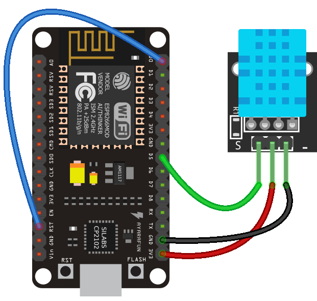
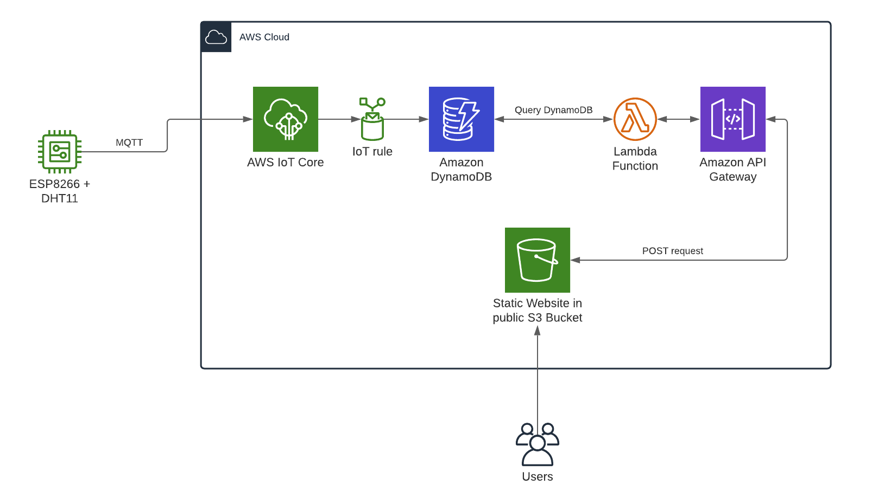
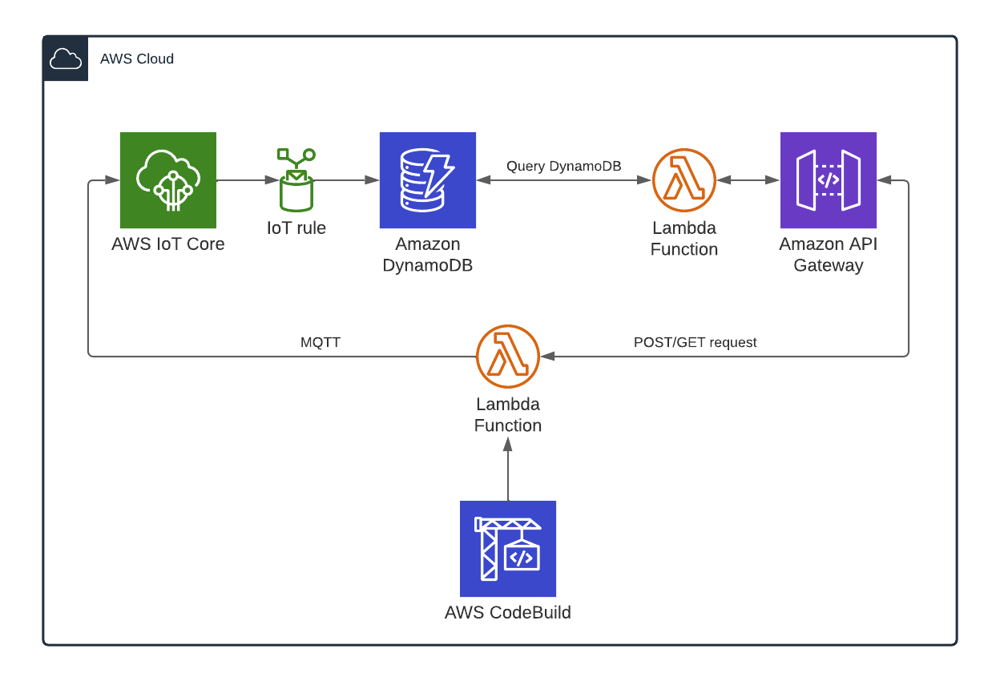

# ESP8266 AWS IoT Core

[](https://aws.amazon.com)
[]()
[](https://docs.aws.amazon.com/cdk/api/v2/)
[]()
[]()

This guide includes instructions to set up a ESP8266 to stream sensor data to AWS IoT Core, store that data in a DynamoDB table and expose a Rest API to retrieve the data.

## 1. ESP8266

<div align="center">
	
	<br>
    Circuit diagram of the Esp 8266 NodeMCU with a DHT11 temperature and humidity sensor.
    <br>
    <br>
</div>

### 1.1 Wiring
- RST to D0 (enables wake up from deep sleep)
- 3V3 to Vin of DHT11
- GND to GND of DHT11
- D5 to S of DHT11 (data)

### 1.2 Dependencies
This section explains how to set up the IDE and install all necessary dependencies.

1. Download and install the [Arduino IDE](https://www.arduino.cc/en/software).

2. Install the ESP8266 Arduino Core: Go to `File` > `Preferences`. In the `Settings` Tab enter the following URL into `Additional Boards Manager URLs`: `http://arduino.esp8266.com/stable/package_esp8266com_index.json`

3. Install the ESP8266 Boards: Go to `Tools` > `Board:(Your current board selection)` > `Boards Manager...`. Search for `esp8266` and install version `2.5.0`.

4. Install the necessary libraries: Go to `Tools` > `Manage Libraries...`. In the Librariy Manager search and install:
    - PubSubClient
    - NTPClient
    - DHT sensor library

### 1.3 SPIFFS
To be able to upload the AWS IoT thing certificate files to the Esp8266 the [SPIFFS Filesystem uploader](https://github.com/esp8266/arduino-esp8266fs-plugin) needs to be installed.

1. Download the tool archive from releases page
2. In the Arduino sketchbook directory, create a directory called `tools` if it doesn't exist yet. The location of the sketchbook directory can be found in the Arduino IDE at `File` > `Preferences` > `Sketchbook location`
3. Unpack the tool into tools directory (the path will look like <sketchbook directory>/tools/ESP8266FS/tool/esp8266fs.jar)
4. Restart Arduino IDE

### 1.4 Creating a AWS IoT Thing

1. In the AWS Management Console search for IoT Core
2. Go to `Manage` > `Things` > `Create things`
3. Provide a name for the thing, leave everything else as default. In the certificate section choose `Auto-generate a new certificate`
4. In the policy section click `Create policy`. In the window that opens choose `Advanced mode` and copy in the following policy with the right region, account-id and topics. This policy allows the thing to publish and subscribe to the defined topics:
    ```
    {
    "Version": "2012-10-17",
    "Statement": [
        {
        "Effect": "Allow",
        "Action": "iot:Connect",
        "Resource": "arn:aws:iot:<region>:<account-id>:client/<thing-name>"
        },
        {
        "Effect": "Allow",
        "Action": "iot:Subscribe",
        "Resource": "arn:aws:iot:<region>:<account-id>:topicfilter/<subscribtion-topic>"
        },
        {
        "Effect": "Allow",
        "Action": "iot:Receive",
        "Resource": "arn:aws:iot:<region>:<account-id>:topic/<subscribtion-topic>"
        },
        {
        "Effect": "Allow",
        "Action": "iot:Publish",
        "Resource": "arn:aws:iot:<region>:<account-id>:topic/<publishing-topic>"
        }
    ]
    }
    ```
5. In the window that opens download the Device certificate, Private key file, Public key file and the Amazon Root Certicificate
6. To convert the files from `.pem` to `.der` open a CLI and run the following commands in the directory with the certificate files, pasting in the certificate id of the files:
    ```
    openssl x509 -in <certificate-id>-certificate.pem.crt.txt -out cert.der -outform DER
    openssl rsa -in <certificate-id>-private.pem.key -out private.der -outform DER
    openssl rsa -in AmazonRootCA1.pem -out ca.der -outform DER
    ```
7. Store the `.der` files in a folder called `data` in the same directory as the arduino project (`.ino` file) and go to `Tools` > `ESP8266 Sketch Data Upload`

### 1.3 Flash the Esp8266

In the Arduino IDE upload the program to the microcontroller after changing the following strings:
```
YOUR_WIFI_SSID
YOUR_WIFI_PASSWORD
YOUR_PUBLISH_TOPIC
YOUR_AWS_ENDPOINT
YOUR_THING_NAME
```

## 2. AWS Architecture

The resources deployed in the AWS cloud will enable storing and retrieval of the IoT sensor data. An IoT rule inserts all data published to a certain MQTT topic into multiple columns of a DynamoDB table. Via a POST request to a REST ApiGateway a lambda function can be triggered to query the database table and return all data from a specified time interval.

<div align="center">
	
	<br>
    Application architecture with Amazon API Gateway and AWS Lambda.
    <br>
    <br>
</div>

### 2.1 Deploy CloudFormation Stack

Everything besides the IoT thing configuration and the website in the S3 bucket can be provisioned automatically by deploying the cdk stack included in the repository. To deploy the stack run the following command:

```
cdk deploy --all
```

Requirements:
- AWS CLI
- NodeJs
- CDK CLI

The application is set up automatically by AWS CodePipeline and AWS CodeBuild on commit to the master branch in GitHub.

### 2.2 Integration Tests

As part of the application deployment integration tests are executed to ensure connectivity and functionality. Dummy messages are sent to the iot core from a lambda function, which subsequenty queries the API gateway and compares the response with the expected value.

<div align="center">
	
	<br>
    Schematic of the integration test process.
    <br>
    <br>
</div>
